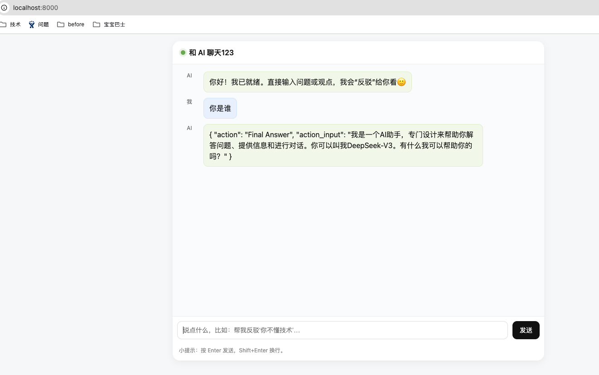

# 须知
全局网络，并且使用终端代理,避免依赖更新不下来
```
export http_proxy=http://127.0.0.1:1087;export https_proxy=http://127.0.0.1:1087;
```

# 启动

```
docker compose build --no-cache #如果不需要缓存才加这个 --no-cache，否则不要加，会很慢
docker compose up

# 停止服务
docker compose down
```
# 页面访问

```
http://localhost:8000
```

# 效果


# 目录结构

app/
├─ main.py                     # 入口：创建 FastAPI、挂载路由与静态
├─ config.py                   # 读取环境变量与全局常量
├─ providers/
│  ├─ llm.py                   # ChatOpenAI 工厂：deepseek / qwen 切换
│  └─ embeddings.py            # Embeddings 工厂：DashScope / OpenAI 兼容
├─ tools/
│  └─ argue.py                 # 示例工具 argue_tool
├─ memory/
│  └─ convo.py                 # 会话记忆（BufferMemory）
├─ agents/
│  └─ agent.py                 # 初始化 Agent（使用你的结构化描述型 Agent）
├─ rag/
│  ├─ loaders.py               # 文档加载（txt/md/pdf/目录）
│  ├─ splitter.py              # 文本切分
│  ├─ vectorstore.py           # Chroma 向量库（持久化）
│  ├─ chain.py                 # RAG Chain（prompt + runnable）
│  └─ ingest.py                # 一键 Ingest 入口
├─ api/
│  ├─ routes_chat.py           # POST /chat 普通对话
│  ├─ routes_rag.py            # POST /ingest, POST /chat_rag
│  └─ routes_health.py         # GET /health
├─ prompts/
│  └─ rag_prompt.py            # RAG 系统提示词
└─ static/
   └─ index.html               # 前端（可选）
